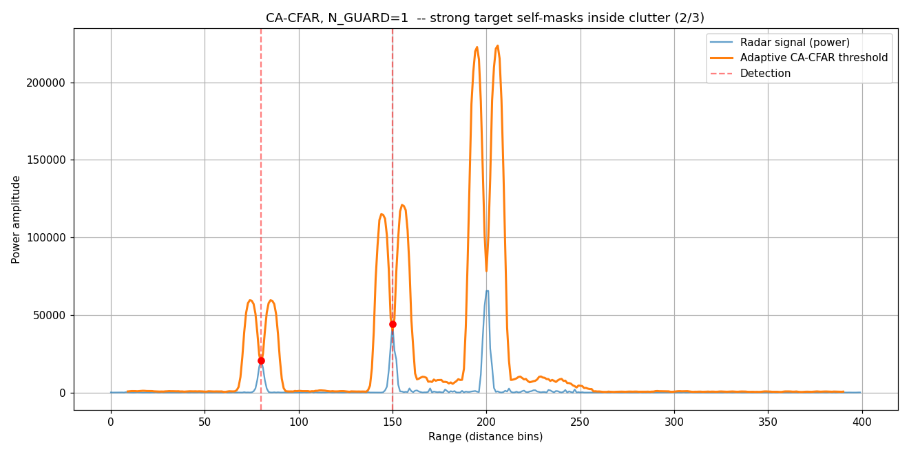
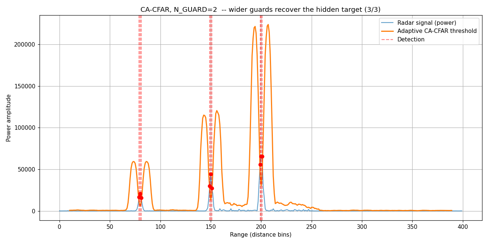

# Configurable CFAR Detector (VHDL)

A parameterizable, streaming **Constant False Alarm Rate (CFAR)** radar target
detector written in VHDL, verified bit-exact against a fixed-point Python golden
model with [cocotb](https://www.cocotb.org/), and synthesized with timing closure
on a Xilinx Artix-7 (Basys 3).

The estimator variant (**CA / GO / SO / OS**) is selected at elaboration time
through a single generic, so one design covers the whole family without paying for
the modes you don't use.

On top of that family, **`src/vi_cfar.vhd` adds VI-CFAR** — an adaptive *composite*
detector that inspects the reference data around each cell and switches between CA,
GO and SO **at run time**, per cell (see the VI-CFAR section below).

---

## What is CFAR?

A radar range profile is an array of **power samples**: each sample is the energy
of the echo returned from one distance bin (the *index* encodes distance via echo
time-of-flight, the *value* encodes reflected energy). A target shows up as a peak.

A fixed detection threshold does not work, because the noise/clutter floor varies
along the profile: set it low and clutter triggers false alarms; set it high and
weak targets are missed. **CFAR sets the threshold adaptively, per cell**, to keep
the false-alarm rate constant regardless of the local noise level.

For each **Cell Under Test (CUT)**, CFAR:

1. Skips a few **guard cells** on each side (so target energy leaking into
   neighbours does not corrupt the noise estimate).
2. Estimates the local noise from the surrounding **reference cells**.
3. Computes `threshold = noise_estimate x alpha`.
4. Declares a detection if `CUT > threshold`.

The CUT is evaluated at the **centre** of a sliding window, so the detector has a
fixed fill latency but a throughput of one sample per clock.

```
[ ref x N/2 ][ guard ][ CUT ][ guard ][ ref x N/2 ]
```

---

## Variants

All variants share the sliding window, guard handling, threshold multiply and
comparison. **The only thing that changes is how the reference cells are combined
into the noise estimate:**

| Variant | Noise estimate | Best for | Weakness |
|---------|----------------|----------|----------|
| **CA** (Cell-Averaging) | mean of all `N` reference cells | homogeneous clutter (statistically optimal) | clutter edges; masks on multiple targets |
| **GO** (Greatest-Of) | `max(mean_left, mean_right)` | clutter edges (keeps false alarms bounded at transitions) | masks a target sitting on one reference side |
| **SO** (Smallest-Of) | `min(mean_left, mean_right)` | closely spaced multiple targets | false-alarm blow-up at clutter edges |
| **OS** (Ordered-Statistic) | k-th value of the sorted reference cells | non-homogeneous clutter + multiple targets | needs a sorting network (larger, slower) |

Selected via the `CFAR_TYPE` generic (`CA`, `GO`, `SO`, `OS`). For `OS`, the rank
`k` is set with the `OS_RANK` generic (1-based).

---

## Fixed-point arithmetic

Everything is unsigned integer arithmetic; no dividers, no truncation.

`alpha` is stored as a fixed-point value scaled by `2^ALPHA_FRAC` (Q?.8):

```
ALPHA_FP = round(alpha * 2^ALPHA_FRAC)      # e.g. alpha=12.45 -> 3188  (Pfa=1e-4, N=16)
```

The detection test `CUT > (ref_sum / N) * (ALPHA_FP / 2^ALPHA_FRAC)` is rearranged
to remove both divisions (which are powers of two) by shifting the CUT instead:

```
CUT << (log2(N) + ALPHA_FRAC)  >  ref_sum * ALPHA_FP
```

So the shift amount is `log2(N) + ALPHA_FRAC`. For **CA** the estimate averages all
`N` cells (`log2(N) + 8`); for **GO/SO** it averages **one side** of `N/2` cells, so
the shift is `log2(N/2) + 8`. For **OS** the estimate is a **single** reference cell
(the k-th smallest), not an average, so there is no division by `N` at all — the
shift is just `ALPHA_FRAC` and the test is `CUT << ALPHA_FRAC > x_(k) * ALPHA_FP`.
In every case the comparison is exact and matches the golden model bit for bit.

> **Note on alpha:** `ALPHA_FP = 3188` is derived from the **CA** formula
> `alpha = N * (Pfa^(-1/N) - 1)`. GO and SO have different alpha-vs-Pfa relationships
> (the statistics of max/min of two averages differ from a single average), and **OS**
> different again (`ALPHA_FP = 33298`, alpha ~= 130 for N=16, k=3 — the ordered-statistic
> threshold factor solves a product-of-terms equation in the rank). RTL and golden agree
> bit-exactly because both use the same alpha, but to hold the target Pfa in GO/SO/OS the
> alpha must be recomputed per variant for your `N`, `k` and `Pfa`.

---

## Architecture

- **Sliding window** implemented as a shift register (`window`), one sample in per
  valid clock.
- **Running sums** instead of combinational adder trees: `sum_all` (whole window,
  for CA) and per-side `left_sum` / `right_sum` (for GO/SO) are each maintained
  incrementally (`+= incoming - outgoing`) with dedicated side shift registers.
  This keeps the critical path short regardless of `N`.
- For **OS**, the reference cells feed a **pipelined bitonic sorting network**
  (`src/bitonic_sort.vhd`); the CUT and `m_valid` are pushed through matching delay
  lines so the k-th ordered statistic lines up with its CUT. Sorter latency is
  `log2(N)*(log2(N)+1)/2` stages (10 for N=16) and `SORT_LAT` is derived from `N_REF`.
- The estimator logic is selected with `if ... generate`, so **only the chosen
  variant is synthesized** — the unused branches (including the sorter) do not exist
  in the fabric.
- `m_valid` deasserts during window fill (edge cells with incomplete neighbourhoods
  are not evaluated).

### Interface

```vhdl
generic (
  CFAR_TYPE  : cfar_t  := CA;   -- CA | GO | SO | OS
  OS_RANK    : integer := 3;    -- OS only: 1-based rank of the ordered statistic
  SAMPLE_W   : integer := 16;   -- input sample width (unsigned power)
  N_REF      : integer := 16;   -- total reference cells (power of two)
  N_GUARD    : integer := 2;    -- guard cells per side
  ALPHA_W    : integer := 16;   -- width of ALPHA_FP
  ALPHA_FP   : integer := 3188; -- alpha * 2^ALPHA_FRAC  (CA default; see note on alpha)
  ALPHA_FRAC : integer := 8     -- alpha fractional bits
);
port (
  clk, rst : in  std_logic;
  s_data   : in  std_logic_vector(SAMPLE_W-1 downto 0);  -- streaming power samples
  s_valid  : in  std_logic;
  m_cut    : out std_logic_vector(SAMPLE_W-1 downto 0);  -- cell under test (for plotting)
  m_detect : out std_logic;                              -- 1 = target
  m_valid  : out std_logic                               -- 0 during fill / edges
);
```

The shared array type `sample_array_t` lives in `cfar_pkg` as an array of
*unconstrained* `std_logic_vector` (VHDL-2008), so both the detector and the sorter
see the same type and each declaration fixes the element width via the double
constraint `sample_array_t(0 to N-1)(SAMPLE_W-1 downto 0)`.

---

## Verification

Verified with cocotb + GHDL against `cfar_golden.py`, a fixed-point model that is
bit-exact to the RTL (same integer arithmetic, same shift-based comparison, same
ordered-statistic selection for OS). The same stimulus (thermal noise + a clutter
region + three targets, one hidden inside the clutter) is fed to both DUT and golden,
and the per-CUT detection decisions are compared bit for bit. For OS the testbench
drains the sorter pipeline (`SORT_LAT` extra cycles) so the last decisions emerge
before the comparison.

```
[CA] PASS: 380 decisions bit-identical to golden
[GO] PASS: 380 decisions bit-identical to golden
[SO] PASS: 380 decisions bit-identical to golden
[OS] PASS: 380 decisions bit-identical to golden
```

`test_diag.py` additionally dumps a per-CUT report on mismatch (RTL vs golden
estimator, threshold and decision) to localise a fault to a specific datapath stage.

### Run it

```bash
# CFAR_MODE must match the RTL's CFAR_TYPE generic; the Makefile also passes the
# matching ALPHA_FP (and OS_RANK) as generic overrides for the mode under test.
CFAR_MODE=CA make
CFAR_MODE=GO make
CFAR_MODE=SO make
CFAR_MODE=OS make              # OS_RANK defaults to 3; override with e.g. OS_RANK=8 make
```

---

## Synthesis (Artix-7, Basys 3, 100 MHz)

| Mode | LUT | FF | DSP | WNS | WHS | Fmax (approx) |
|------|-----|----|-----|-----|-----|---------------|
| CA   | 141  | 202  | 1 | +5.922 ns | +0.128 ns | ~245 MHz |
| GO   | 142  | 202  | 1 | +5.925 ns | +0.069 ns | ~245 MHz |
| SO   | 142  | 202  | 1 | +5.751 ns | +0.111 ns | ~235 MHz |
| OS   | 1828 | 2101 | 1 | +4.379 ns | +0.043 ns | ~178 MHz |
| VI\* | 517  | 463  | 12 | +4.574 ns | +0.102 ns | ~184 MHz |

All four `CFAR_TYPE` modes — and the standalone **VI** composite — close timing at the
100 MHz constraint (10 ns) with positive setup **and** hold slack and zero failed
routes. The averaging variants (CA/GO/SO) are
tiny — ~140 LUT, ~200 FF, and a single DSP for the alpha multiply. **OS** adds the
pipelined bitonic sorting network (16 elements, 10 compare-swap stages), which costs
roughly **13x the LUTs and 10x the FFs** and pulls Fmax down to ~178 MHz; the sorter
is pure compare-swap logic, so it adds no DSPs. Fmax is estimated as `1/(T - WNS)` at
the 100 MHz constraint and is indicative, not a swept maximum.

\* **VI** is the standalone composite (its own `vi_cfar` top-level, not a `CFAR_TYPE`
selection). Its second-order VI/MR datapath is where the **12 DSPs** and the slightly
higher LUT/FF come from; it still clears 100 MHz by a wide margin at 0.09 W. Full
details in the next section.

---

## VI-CFAR (adaptive composite detector)

`src/vi_cfar.vhd` is a separate top-level that does at **run time** what `CFAR_TYPE`
does at elaboration: for every CUT it inspects the surrounding reference data and
adapts between **CA, GO and SO** on a cell-by-cell basis. This is the
Variability-Index CFAR of Smith & Varshney — low-loss like CA in homogeneous
clutter, false-alarm control like GO at clutter edges, and multiple-target
robustness like SO — without committing to one mode up front.

Because the choice is per-cell, VI-CFAR **cannot** use the `if ... generate` trick:
the CA, GO and SO estimators must all exist in the fabric at once and be muxed by
the decision. It is a *superset* of the averaging family, not a member of it, which
is why it lives in its own entity rather than as another `CFAR_TYPE`.

### Decision logic

Two statistics, both computed from the two half-windows (**A** = leading,
**B** = lagging), drive the decision:

- **Variability Index** per window: `VI = (N/2) * Σx² / (Σx)²`, a second-order
  statistic. `VI <= K_VI` means the window is *homogeneous*; above it, *variable*
  (a target or edge lives there).
- **Mean Ratio** between windows: `MR = SumA / SumB`. Inside `[1/K_MR, K_MR]` the
  two sides sit at the *same* level.

| Window A (lead) | Window B (lag) | Means | Environment | Noise estimate |
|-----------------|----------------|-------|-------------|----------------|
| homogeneous | homogeneous | same      | homogeneous      | **CA** over both windows (`N` cells) |
| homogeneous | homogeneous | different | clutter edge     | **GO** = greater side (`N/2`) |
| homogeneous | variable    | —         | interferer in B  | CA over **A** only (`N/2`) |
| variable    | homogeneous | —         | interferer in A  | CA over **B** only (`N/2`) |
| variable    | variable    | —         | multiple targets | **SO** = smaller side (`N/2`) |

### What VI adds to the datapath

- A **squares window** running in lockstep with the sample window, and running
  **sum-of-squares** per side (`sq_left_sum` / `sq_right_sum`) maintained the same
  incremental `+= incoming - outgoing` way as the raw sums. Each incoming sample is
  squared **once** and reused for both the accumulator and the shift register — a
  single squarer on the streaming path.
- The **VI test** is kept division-free by cross-multiplying:
  `m*SqA << F  <=  K_VI * SumA²` (with `m = N/2`, a power of two, folded into the
  shift). It carries a `SumA²` term, so this comparison is wide (~53 b) — much wider
  than the **MR test**, which is linear in the sums (~30 b). Each gets its own
  comparison width.
- **Per-mode alpha.** Normalising over `N` (both windows) vs `N/2` (single window)
  needs different scale factors to hold one Pfa, so the mux selects the shift **and**
  the alpha together: `ALPHA_FP_BOTH` for CA-over-both, `ALPHA_FP_HALF` for
  GO / SO / single-window CA.
- **Zero added latency.** Everything downstream of the registered front-end is
  combinational, so — unlike OS — there is no pipeline to drain and no delay line:
  the CUT lines up with its decision in the same cycle.

### Verification

Same method as the base design: cocotb + GHDL against `golden/vi_cfar_golden.py`, a
fixed-point model that runs the VI and MR tests in the **same** cross-multiplied
integer form as the RTL (a float model would disagree exactly at the decision
boundaries). The stimulus is built to exercise all five branches, and every per-CUT
decision matches bit for bit:

```
[VI] PASS: 4980 decisions bit-identical to golden
     branch mix: CA-both 2331   GO 1032   CA-A 622   CA-B 630   SO 365
```

The thresholds (`K_VI_FP`, `K_MR_FP`) and both alphas are passed to the golden
**and** the RTL from the same Makefile variables, so the bit-exact check holds while
you sweep them.

### On the FPGA

On Artix-7 (Basys 3) it closes the 100 MHz constraint with **+4.574 ns** setup slack
(Fmax ~184 MHz), using ~2.5% of LUTs, ~1.1% of FFs and **12 / 90 DSPs** at 0.09 W —
the `VI` row in the synthesis table above. The 12 DSPs are the second-order cost: the
sample squarer plus the `Sum²` and constant multiplies in the VI / MR tests and the
`estimator * alpha`. They share/pipeline down if ever needed, but at 13% there is no
pressure.

### Run it

```bash
make -f Makefile.vi                                   # SIM=ghdl by default
make -f Makefile.vi K_VI_FP=1100 ALPHA_FP_HALF=4600   # sweep thresholds / alpha
```

> **Tuning:** the canonical `K_VI ~= 4.76`, `K_MR ~= 1.806` and the two alphas were
> derived for a specific `N` and Pfa. Bit-exactness proves the *arithmetic* is right;
> holding your **target Pfa** in each environment is the empirical step — sweep the
> four constants against the golden until the false-alarm rate lands.

---

## The self-masking effect

The bundled scenario includes a strong target buried in high-variance clutter. With
narrow guards (`N_GUARD=1`), CA-CFAR **fails to detect it**: the target's own energy
leaks past the single guard cell into the reference cells, inflating the local noise
estimate and pushing the threshold above the (saturated) peak — the target masks
itself.

Widening the guard band (`N_GUARD=2`) puts the target's shoulders inside the guard
cells instead of the reference cells, drops the threshold, and recovers the target.
This is the textbook trade-off between guard width and reference locality, and both
configurations are included to illustrate it.

| N_GUARD=1 (self-masking, 2/3 detected) | N_GUARD=2 (recovered, 3/3 detected) |
|----------------------------------------|-------------------------------------|
|       |       |

---

## Repository layout

```
.
|-- src/
|   |-- cfar_pkg.vhd        -- cfar_t enum + unconstrained sample_array_t (CA/GO/SO/OS)
|   |-- bitonic_network.vhd    -- pipelined bitonic sorting network (used by OS)
|   |-- cfar.vhd            -- the configurable detector (CA/GO/SO/OS)
|   `-- vi_cfar.vhd         -- VI-CFAR composite (adaptive CA/GO/SO)
|-- golden/
|   |-- cfar_golden.py      -- fixed-point reference model (CA/GO/SO/OS)
|   `-- vi_cfar_golden.py   -- fixed-point reference model (VI-CFAR)
|-- tb/
|   |-- test_ca_cfar.py     -- cocotb testbench, CA/GO/SO/OS (variant via CFAR_MODE)
|   |-- test_vi_cfar.py     -- cocotb testbench, VI-CFAR
|   |-- test_diag.py        -- diagnostic testbench (per-CUT RTL-vs-golden dump)
|   |-- Makefile            -- CA/GO/SO/OS
|   `-- Makefile.vi         -- VI-CFAR
|-- docs/
|   |-- nguard1.png
|   `-- nguard2.png
`-- README.md
```

---

## Roadmap

- [x] CA / GO / SO / OS variants, generic-selected
- [x] Running-sum datapath (no combinational adder trees)
- [x] OS-CFAR with a pipelined bitonic sorting network
- [x] Bit-exact verification vs fixed-point golden (cocotb)
- [x] Timing closure on Artix-7 (all four modes @ 100 MHz)
- [x] **VI-CFAR** composite — adaptive CA/GO/SO, per-mode alpha, verified bit-exact + 100 MHz (~184 MHz, 12 DSP)
- [ ] Per-variant alpha for the standalone GO / SO / OS modes (correct Pfa)
- [ ] Pfa sweep / tuning of `K_VI`, `K_MR` and the two VI-CFAR alphas
- [ ] 2-D (Range-Doppler) CFAR